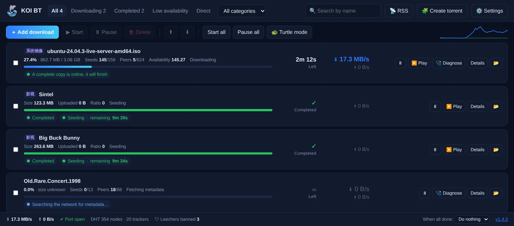

<p align="center"></p>

<h1 align="center">KOI BT</h1>

<p align="center">A friendly, transparent BitTorrent &amp; HTTP downloader that plays fair · Windows · Free and open source</p>

<p align="center">
  <a href="https://github.com/koi-apps/koi-bt/releases/latest">Download</a> ·
  <a href="README.md">中文</a> ·
  <a href="#faq">FAQ</a>
</p>



## Why KOI BT

Most downloaders have a catch: some are bloated and full of ads, some are powerful but intimidating, and some are no longer maintained. KOI BT aims to be a downloader you can use without reading a manual, and one that **tells you why** a download is slow or stuck.

It runs on [libtorrent](https://libtorrent.org/), the same engine as qBittorrent, so speed and stability are proven. KOI BT focuses on the experience around it.

## Features

**Status you can understand**
- 🚦 **Know up front whether a torrent can finish.** When no complete copy exists online, the task is flagged *Low availability* and shows the highest percentage it can reach, so you stop waiting on a torrent stuck at 99%.
- 🩺 **Diagnose and fix in one click.** Checks disk space, trackers, DHT, port reachability, carrier NAT (CGNAT), seeds, speed limits and queueing, with a fix button for each problem.
- Large, aligned speed and time-remaining columns, plus a seeding countdown.

**BitTorrent**
- Magnet links and .torrent files: drag them in, paste with Ctrl+V, or just copy a link and the add dialog opens.
- Batch add: a torrent list on top and a collapsible folder tree below. Pick only the files you want; total size and free disk space are shown.
- ▶️ **Stream while downloading.** Prioritizes the start, end and current position of a video; opens in PotPlayer / VLC or the built-in player.
- 🛡 **Anti-leech.** Bans clients that never upload, by client name and by behavior (taking data while reporting fake progress).
- Public tracker lists (skipped for private torrents), UPnP, encryption, and interface binding to keep traffic on your VPN.
- Seed for a set time after finishing (10 minutes by default) or until a share ratio.
- Create and seed your own torrents.

**Direct downloads**
- Multi-threaded with dynamic segment splitting; backs off automatically when a server limits connections.
- Resumable; decodes `thunder://`, `qqdl://` and `flashget://` links.
- Browser extension for Chrome / Edge that hands downloads to KOI BT with your login cookies.

**Convenience**
- 📡 RSS feeds with keyword rules for automatic downloads.
- Categories with their own folders, move-when-done, and a watch folder.
- 🐢 Turtle mode, scheduled speed limits, sleep or shut down when everything finishes.
- 📱 Remote control from your phone on the same network (scan a QR code, password required).
- qBittorrent-compatible WebAPI: Sonarr / Radarr and qBittorrent remote apps connect directly.
- One-click updates, signed and verified; you choose when to restart.
- Interface in English, Simplified Chinese and Traditional Chinese.

## Install

Get the latest build from [Releases](https://github.com/koi-apps/koi-bt/releases/latest):

- `KOI-BT-x.y.z-setup.exe`: installer (recommended). Installs per user, no admin rights needed.
- `KOI-BT-x.y.z-portable.zip`: portable version.
- `SHA256SUMS.txt`: checksums.

Requires Windows 10 / 11 (64-bit) and Microsoft Edge WebView2, which ships with Windows 11 and recent Windows 10 builds.

> On first launch, allow KOI BT through Windows Firewall so peers can connect to you.
> Builds are not code-signed yet, so SmartScreen may warn you. Click "More info → Run anyway". We are applying for free open-source code signing.

## FAQ

**Is it slower than Xunlei (Thunder)?**
Xunlei adds its own private servers and cache, which no other client can use. On the public BitTorrent network KOI BT is as fast as qBittorrent, and because it uploads fairly, other peers are happier to send to you.

**Stuck at 99%?**
Usually nobody online has the complete file. KOI BT flags these tasks as *Low availability* and shows how far they can get. Wait for a seed or pick a better-seeded torrent.

**Can I use it for piracy?**
KOI BT is a general-purpose download tool. It ships no content and no content search. Only download what you have the right to, and follow the law where you live.

## Run from source

```bash
pip install -r requirements.txt
python main.py              # desktop window
python main.py --headless   # backend only; open http://127.0.0.1:18790 in a browser
```

Windows build: run `build.bat`. Releases are built by `.github/workflows/release.yml` when a `v*` tag is pushed (installer, portable zip and a signed update manifest).

Contributions are welcome. If you change UI text, run `python tools/build_i18n.py` and add the English string to `static/i18n/en.json`.

## License

[GPL-3.0](LICENSE)
