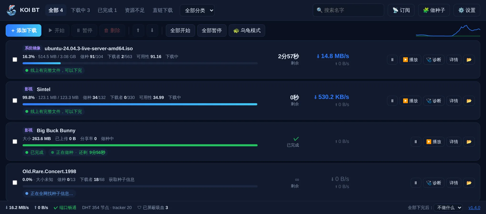
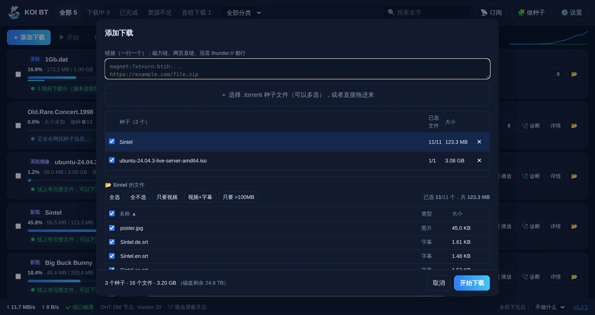
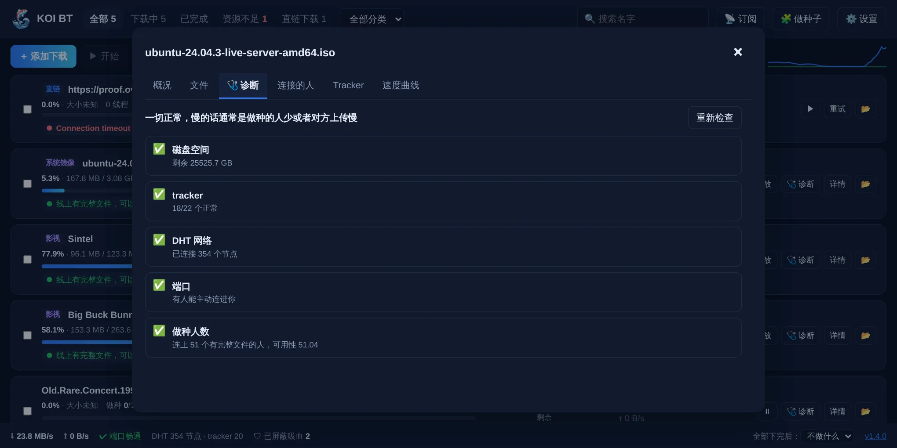
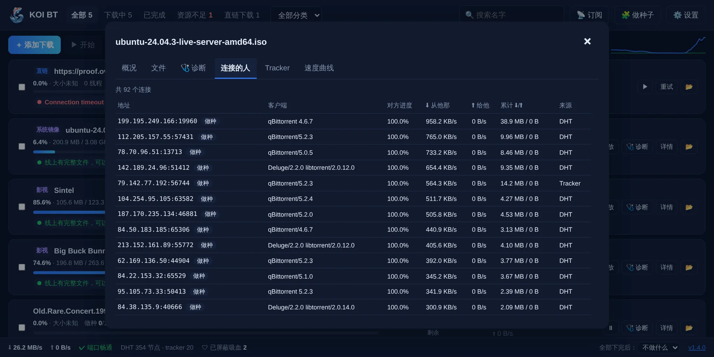
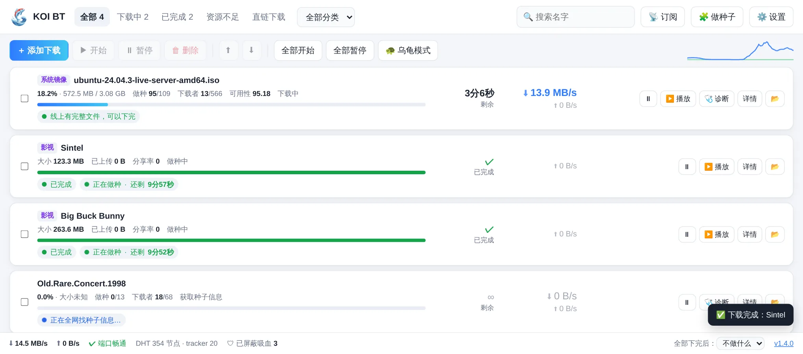

<p align="center"></p>

<h1 align="center">KOI BT</h1>

<p align="center">好用、透明、不吸血的 BT / 直链下载器 · Windows · 开源免费</p>

<p align="center">
  <a href="https://github.com/koi-apps/koi-bt/releases/latest">下载最新版</a> ·
  <a href="README.en.md">English</a> ·
  <a href="#常见问题">常见问题</a>
</p>



## 为什么做 KOI BT

现在常用的下载器都有让人头疼的地方：迅雷臃肿、有广告，在公共 BT 网络里只下不传；qBittorrent 功能很强，但对新手不友好；Motrix 已经好几年没更新。KOI BT 想做的是一个**打开就会用、出了问题会告诉你为什么**的下载器。

下载内核是 [libtorrent](https://libtorrent.org/)，和 qBittorrent 用的是同一个，速度和稳定性有保障。KOI BT 在体验上下功夫。

## 功能

**看得懂的下载状态**
- 🚦 **能不能下完，一眼就知道**：线上凑不齐完整文件时，任务会标成「资源不足」，并告诉你最多能下到百分之几。卡在 99% 的种子不用再白等一晚上
- 🩺 **诊断 + 一键修复**：任务很慢或者不动时，逐项检查磁盘空间、tracker、DHT、端口、运营商内网（CGNAT）、做种人数、限速、排队，有问题的项可以一键修复
- 每个任务都显示醒目的速度、剩余时间，以及做种倒计时

**BT 下载**
- 磁力链、种子文件都支持：可以拖进窗口、Ctrl+V 粘贴，复制链接时也会自动弹出添加窗口
- 批量添加：上面是种子列表，下面是按文件夹折叠的文件树，可以只勾要的文件，下方显示总大小和磁盘剩余空间
- ▶️ **边下边播**：优先下载视频开头、结尾和你正在看的位置；会调用 PotPlayer / VLC 播放，也可以用内置播放器
- 🛡 **屏蔽吸血客户端**：按客户端名字识别迅雷、QQ旋风、百度、影音先锋等，也按行为识别「只拿不给、谎报进度」的客户端，自动拉黑
- 自动加载公开 tracker 列表（私有种子不加）、UPnP 自动开端口、加密传输、绑定网卡（挂 VPN 时防止泄露真实 IP）
- 下载完的做种时长可以自己设（默认 10 分钟），也可以按分享率停止
- 自己做种子分享：选一个文件或文件夹，生成种子并开始做种

**直链下载**
- 多线程动态分段：先下完的线程会把最慢那段劈一半接着下。服务器限制连接数时会自动减少线程
- 支持断点续传，能识别迅雷 `thunder://`、QQ旋风 `qqdl://`、快车 `flashget://` 链接
- 配套浏览器扩展：在 Chrome / Edge 里点下载，会交给 KOI BT 下，并带上登录状态

**省心**
- 📡 RSS 订阅加关键词规则，新剧集出来自动下载
- 分类：不同类型自动存到不同文件夹；下完可以自动移动；支持监视文件夹
- 🐢 乌龟模式（一键限速）、按时段自动限速、全部下完后睡眠或关机
- 📱 手机远程控制：同一个网络里扫二维码就能打开，需要密码
- 兼容 qBittorrent WebAPI，Sonarr / Radarr 和 qBittorrent 手机遥控 App 可以直接连
- 一键更新：更新包带数字签名，下载完由你决定什么时候重启
- 界面支持简体中文、繁體中文、English

<table>
<tr><td></td><td></td></tr>
<tr><td align="center">批量添加：只勾需要的文件</td><td align="center">诊断：告诉你为什么慢</td></tr>
<tr><td></td><td></td></tr>
<tr><td align="center">连接的用户和来源</td><td align="center">跟随系统的浅色 / 深色模式</td></tr>
</table>

## 下载安装

到 [Releases](https://github.com/koi-apps/koi-bt/releases/latest) 下载：

- `KOI-BT-x.y.z-setup.exe`：安装版（推荐）。安装到当前用户目录，不需要管理员权限
- `KOI-BT-x.y.z-portable.zip`：免安装版，解压就能用
- `SHA256SUMS.txt`：文件校验值

系统要求：Windows 10 / 11 64 位。界面依赖 Microsoft Edge WebView2，Windows 11 和较新的 Windows 10 都已经自带。

> 第一次打开时，Windows 防火墙会问是否允许联网，请点「允许」，否则别人连不进你，速度会慢。
> 目前安装包还没有代码签名，Windows 可能提示「已保护你的电脑」，点「更多信息 → 仍要运行」即可。我们正在申请开源项目的免费代码签名。

## 常见问题

**速度比迅雷慢？**
迅雷有自己的服务器和离线缓存，这部分是它的私有网络，其他软件都用不了。公共 BT 网络里，KOI BT 和 qBittorrent 一样快；而且 KOI BT 会正常上传，别的用户更愿意给你传。

**一直卡在 99%？**
多半是线上没有人有完整的文件。KOI BT 会把这类任务标成「资源不足」，并显示最多能下到多少。可以等做种的人上线，或者换一个做种人多的种子。

**为什么默认做种 10 分钟？**
BT 靠大家互相分享。下完再分享一会儿，对别人有帮助，也让你在网络里更受欢迎。设置 → 做种 里可以改成不做种或一直做种。

**能用来下载盗版吗？**
KOI BT 是通用的下载工具，不提供任何资源，也不内置资源搜索。请只下载你有权下载的内容，并遵守你所在地区的法律。

## 从源码运行

```bash
pip install -r requirements.txt
python main.py              # 打开窗口
python main.py --headless   # 只运行后台，用浏览器访问 http://127.0.0.1:18790
```

Windows 打包：运行 `build.bat`。发布流程在 `.github/workflows/release.yml`：推送 `v*` 标签后，会自动打出安装包、免安装版和签名过的更新清单。

### 代码结构

| 路径 | 作用 |
|---|---|
| `koi/engine.py` | BT 内核：任务、能不能下完的判断、吸血屏蔽、边下边播 |
| `koi/httpdl.py` | 直链多线程下载 |
| `koi/server.py` | 本地接口，包括 qBittorrent 兼容接口、播放流、远程访问 |
| `koi/updater.py` | 在线更新（ECDSA 签名校验） |
| `koi/rss.py` | RSS 订阅 |
| `koi/winsys.py` | Windows 相关：剪贴板、文件关联、电源、托盘文字 |
| `static/` | 界面（原生 HTML / CSS / JS，没有构建步骤） |
| `static/i18n/` | 语言包；繁体由 `tools/build_i18n.py` 用 OpenCC 生成 |
| `browser_extension/` | Chrome / Edge 扩展 |

### 参与贡献

欢迎提 Issue 和 Pull Request。改了界面文字后，请运行 `python tools/build_i18n.py`，并在 `static/i18n/en.json` 里补上英文翻译。

## 隐私与代码签名

KOI BT 不收集任何个人数据，详见 [PRIVACY.md](PRIVACY.md)。代码签名政策见 [CODE_SIGNING_POLICY.md](CODE_SIGNING_POLICY.md)。

## 许可证

[GPL-3.0](LICENSE)。你可以自由使用、修改和分发 KOI BT；分发修改后的版本时，也必须以 GPL-3.0 开源。
